# Evidencia de Funcionamiento
## Obligatorio SRD - Fósil Energías Renovables

**Deployment completo automatizado con Terraform**

---

## 1. Infraestructura Desplegada

### 1.1 Terraform Apply Exitoso

**Comando ejecutado:**
```bash
terraform apply -auto-approve
```

**Captura:** Terraform output mostrando las 5 VMs desplegadas

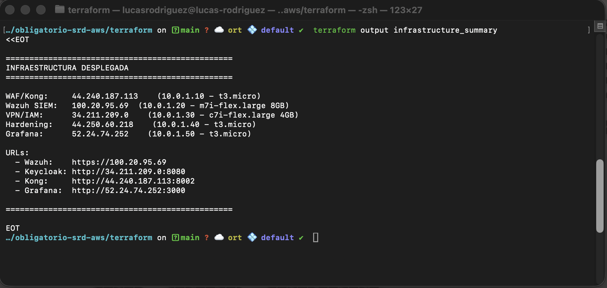

**Verificación:** Todas las VMs accesibles por SSH

---

## 2. SIEM - Wazuh

### 2.1 Acceso a Wazuh Dashboard

**URL:** https://<WAZUH_IP> \
**Usuario:** admin \
**Password:** (ejecutar en VM: `sudo cat /root/wazuh-passwords.txt`)

### 2.2 Agentes Conectados

**Dashboard Wazuh:** 4 agentes activos

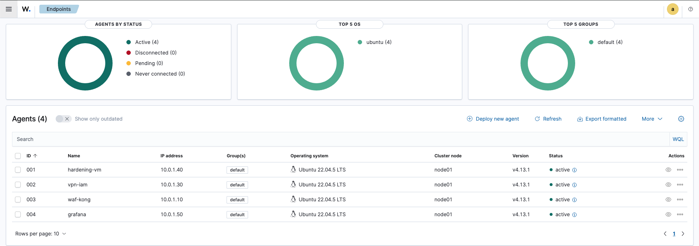

**Agentes esperados:**
- waf-kong (10.0.1.10)
- vpn-iam (10.0.1.30)
- hardening-vm (10.0.1.40)
- grafana (10.0.1.50)

**Nota:** El servidor Wazuh (10.0.1.20) no aparece como agente ya que es el manager central.

### 2.3 Reglas Custom Cargadas

**Verificación:** 17 reglas custom en local_rules.xml

**Comando:**
```bash
ssh ubuntu@<WAZUH_IP> "sudo grep -E '<rule id=\"100' /var/ossec/etc/rules/local_rules.xml"
```

**Captura:** Lista de reglas 100001-100043


**Reglas esperadas:**
- 100001-100004: SSH Brute Force
- 100010-100014: WAF Detection
- 100020-100023: File Integrity Monitoring
- 100040-100043: IAM Behavioral Analytics

### 2.4 Caso de Uso 1: SSH Brute Force

**Testing:** 6 intentos SSH fallidos en hardening-vm

**Comando:**
```bash
for i in {1..6}; do ssh wronguser@<HARDENING_IP>; sleep 2; done
```

**Captura 1:** Alertas en Wazuh Dashboard (Rule 100004)

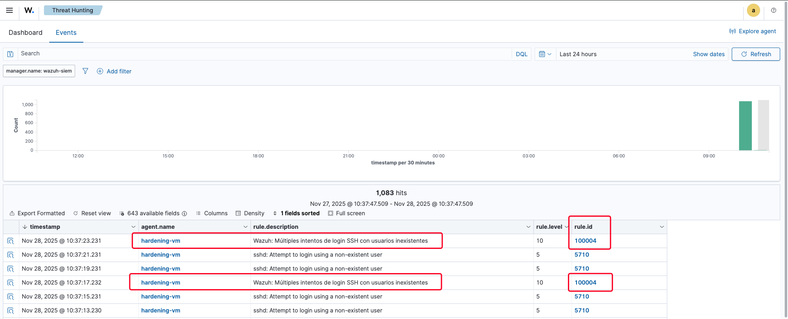

**Reglas disparadas:**
- 5710 (base: SSH non-existent user)
- 100004 (correlation: múltiples intentos)

### 2.5 Caso de Uso 2: WAF → SIEM Integration

**Testing:** Ataques web bloqueados por ModSecurity

**Comandos:**
```bash
export WAF_IP=<PUBLIC_IP_WAF> #(reemplazar IP con tu WAF_IP)

# SQL Injection (URL encoded)
curl -v "http://$WAF_IP/?id=1%27%20OR%20%271%27%3D%271"

# XSS (URL encoded)
curl -v "http://$WAF_IP/?search=%3Cscript%3Ealert%281%29%3C%2Fscript%3E"

# Path Traversal (URL encoded)
curl -v "http://$WAF_IP/?file=..%2F..%2Fetc%2Fpasswd"

# Scanner Detection
curl -v -A "sqlmap/1.0" "http://$WAF_IP/"
```

**Resultado esperado:** HTTP/1.1 403 Forbidden (ModSecurity bloqueando)

**Captura 1:** ModSecurity bloqueando ataques (403 Forbidden)

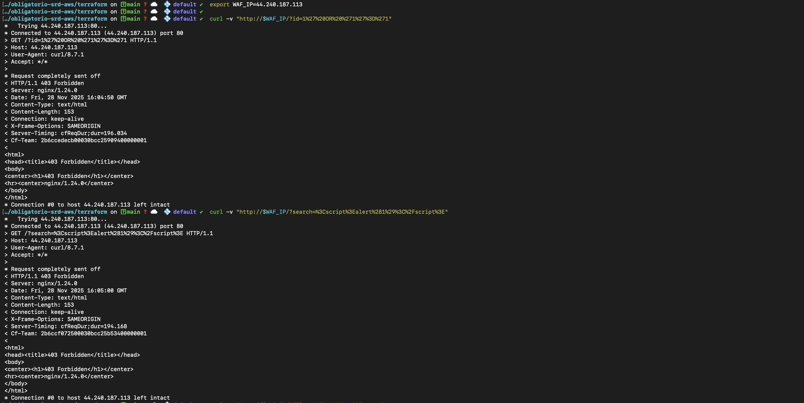

**Captura 2:** ModSecurity bloqueando ataques (403 Forbidden)

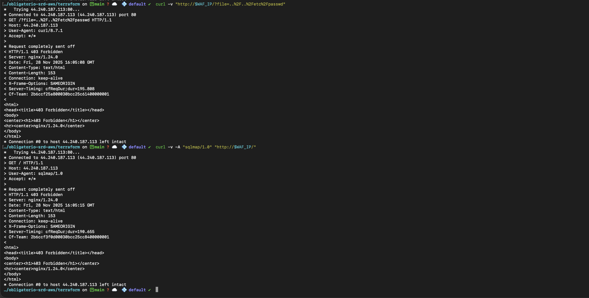

**Captura 3:** Eventos en Wazuh (Rules 100010, 100011, 100013)

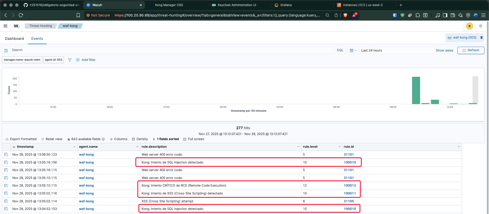

**Reglas disparadas:**
- 31333 (base: ModSecurity access denied 403)
- 100010 (SQL Injection detection)
- 100011 (XSS detection)
- 100012 (Remote Code Execution)
- 100013 (Path Traversal detection)


### 2.6 Caso de Uso 3: File Integrity Monitoring

**Testing:** Modificación de /etc/passwd

**Comando:**
```bash
sudo echo "test_fim:x:9999:9999::/tmp:/bin/false" >> /etc/passwd
```

**Captura:** Alerta inmediata en Wazuh (Rule 100020)

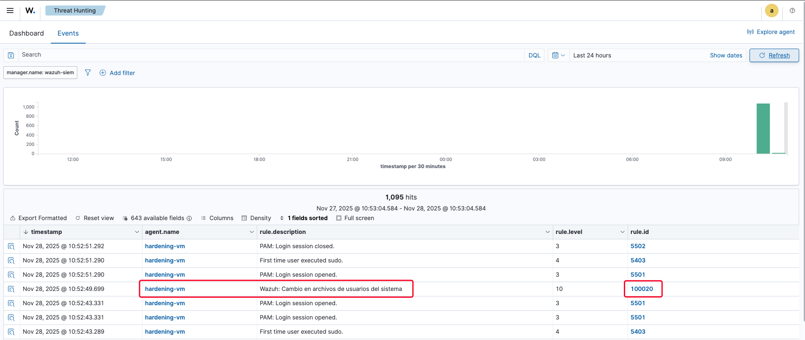

**Reglas disparadas:**
- 550 (base: Integrity checksum changed)
- 100020 (custom: /etc/passwd modification)

---

## 3. WAF + API Gateway

### 3.1 Kong Gateway Funcional

**Admin GUI:** http://<WAF_IP>:8002

**Captura:** Dashboard Kong mostrando servicios configurados

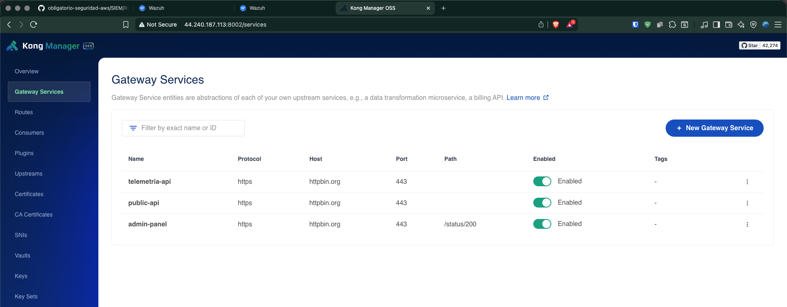

**Servicios activos:**
- /api/telemetria (rate limiting 20 req/min)
- /api/energia
- /admin (bloqueado desde IPs externas)

### 3.2 ModSecurity + OWASP CRS

**Testing:** Ataques OWASP Top 10 bloqueados

**Captura:** Logs de Nginx mostrando 403 Forbidden

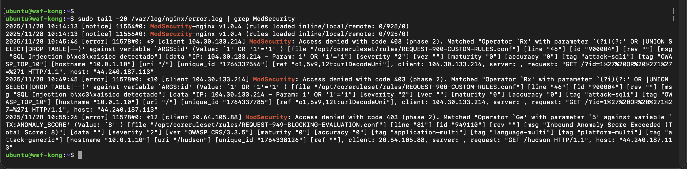

---

## 4. IAM - Keycloak

### 4.1 Realm "fosil" Creado Automáticamente

**Admin Console:** http://<VPN_IP>:8080

**Captura 1:** Realm "fosil" en lista de realms

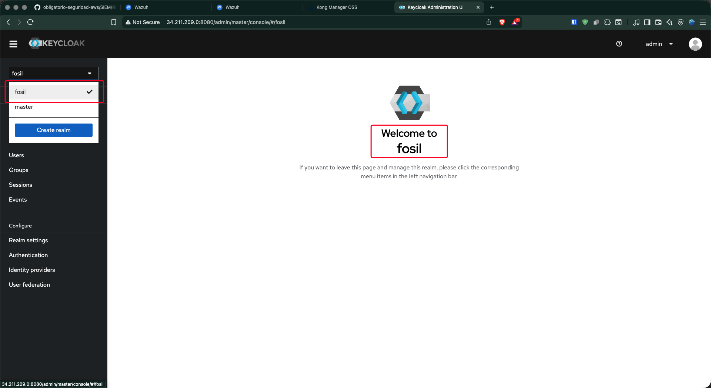

**Captura 2:** 3 usuarios creados automáticamente

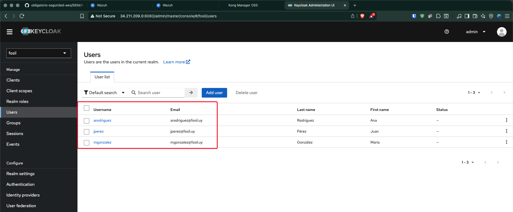

**Usuarios:**
- jperez@fosil.uy (infraestructura-admin)
- mgonzalez@fosil.uy (devops)
- arodriguez@fosil.uy (viewer)

### 4.2 Cliente OAuth2 Grafana

**Captura:** Cliente "grafana-oauth" configurado con redirectUris

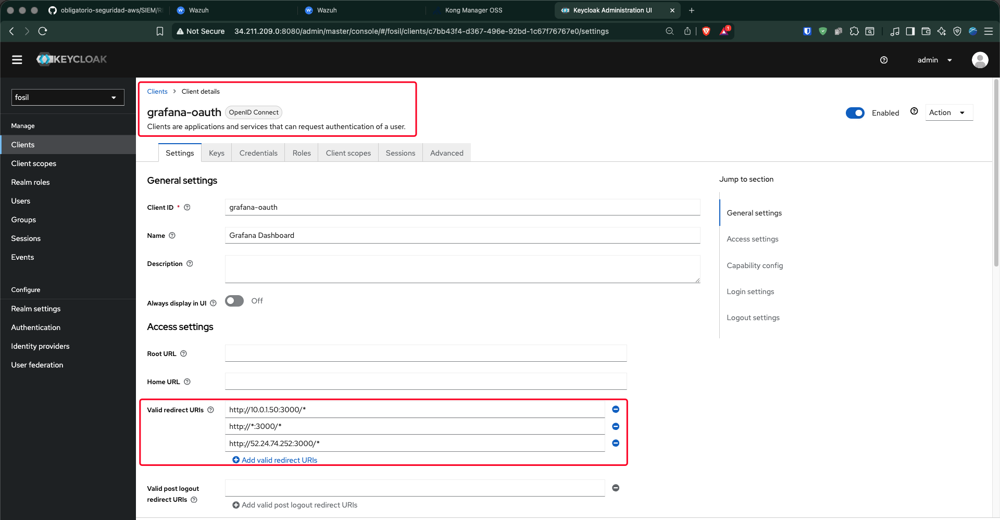

**redirectUris esperadas:**
- http://10.0.1.50:3000/*
- http://*:3000/*
- http://<GRAFANA_PUBLIC_IP>:3000/*

### 4.3 Roles y Mapeo

**Captura:** 3 roles definidos en realm fosil

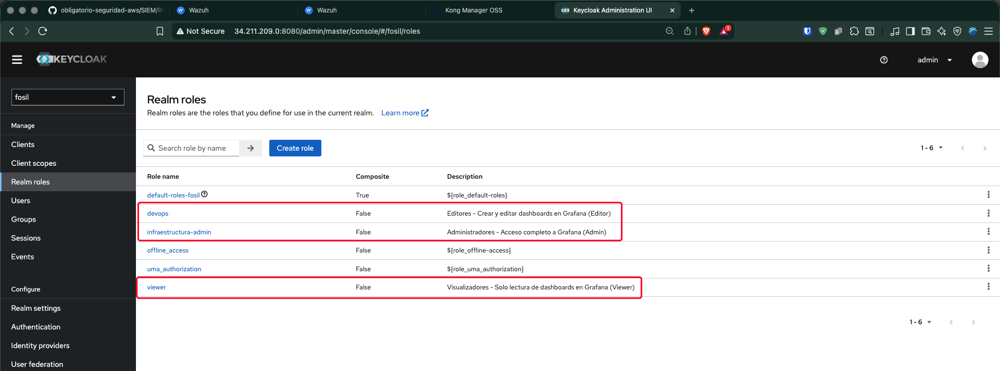

**Roles:**
- infraestructura-admin
- devops
- viewer

---

## 5. Grafana + OAuth2

### 5.1 Login con Keycloak

**URL:** http://<GRAFANA_IP>:3000

**Captura 1:** Pantalla de login mostrando "Sign in with Keycloak"

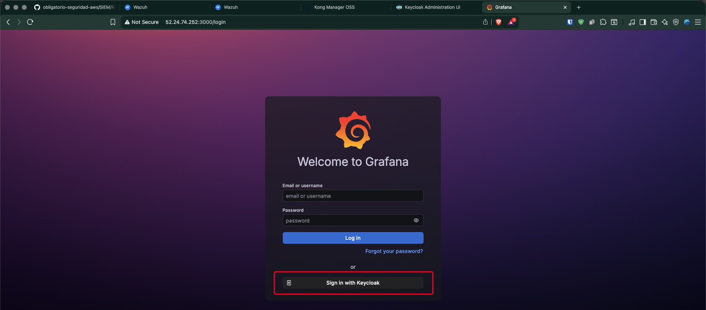

**Captura 2:** Redirect a Keycloak para autenticación

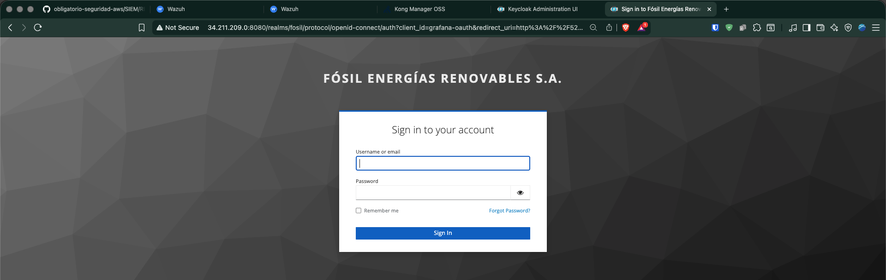

**Captura 3:** Dashboard Grafana después de login exitoso (usuario jperez)


### 5.2 Mapeo de Roles Funcionando

**Testing:** Login con 3 usuarios diferentes

**Captura:** Usuario "jperez@fosil.uy" con rol Admin en Grafana

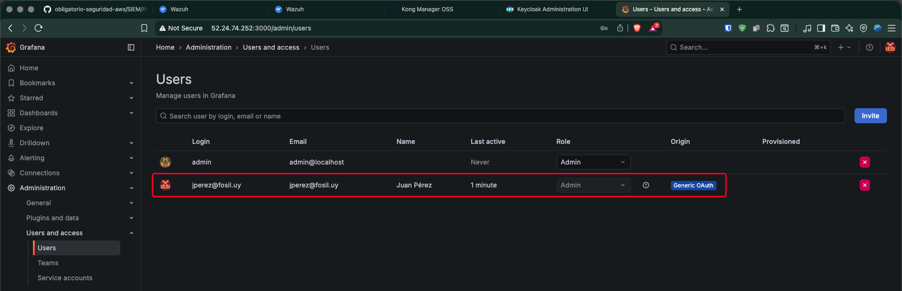

**Verificación:**
- jperez → Admin (puede crear datasources)
- mgonzalez → Editor (puede crear dashboards)
- arodriguez → Viewer (solo lectura)

---

## 6. Hardening CIS Benchmark

### 6.1 SCA Score ANTES (Vanilla)

**VM sin hardening aplicado**

**Captura:** Wazuh SCA mostrando score ~45%

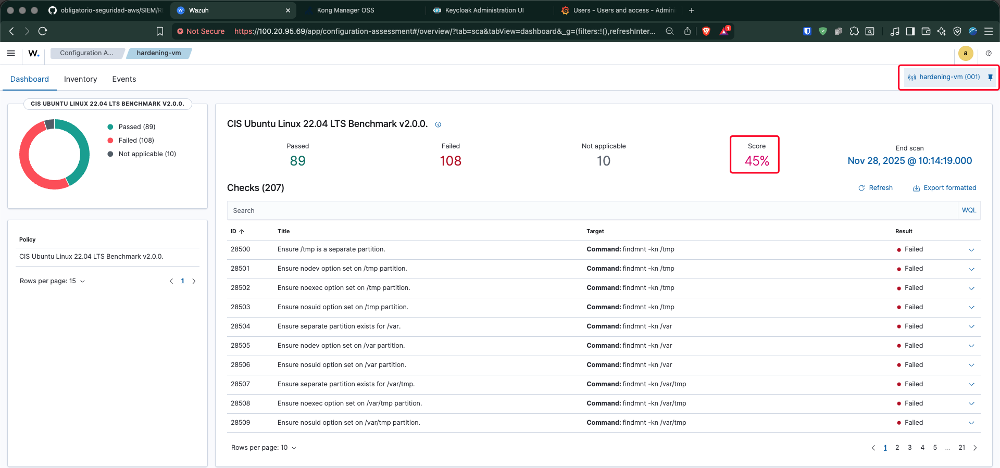

### 6.2 Aplicación de Hardening

**Comando ejecutado:**
```bash
sudo bash /opt/fosil/Hardening/scripts/apply-cis-hardening.sh
```

**Captura:** Script ejecutándose y reiniciando VM

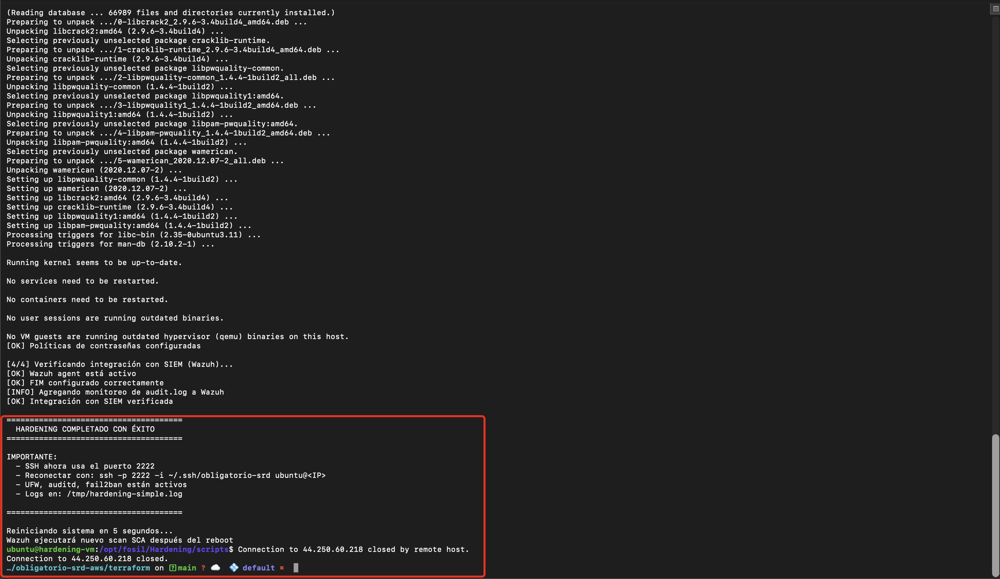

### 6.3 SCA Score DESPUÉS (Hardened)

**VM con CIS Level 1 aplicado**

**Captura:** Wazuh SCA mostrando score ~57%

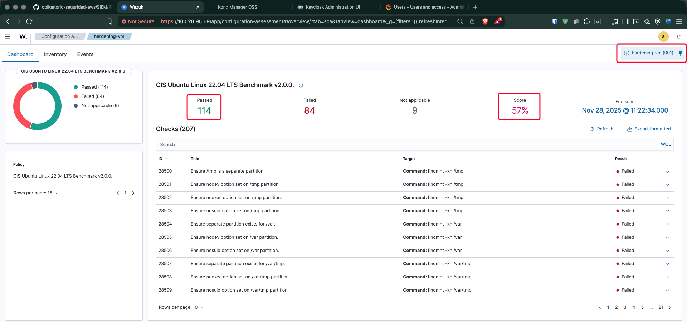

**Mejora:** +12% (45% → 57%)

### 6.4 Servicios de Seguridad Activos

**Verificación en VM hardening:**

**Captura 1:** UFW activo

```bash
sudo ufw status verbose
```

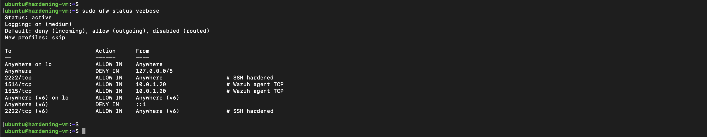

**Captura 2:** Fail2ban monitoreando SSH

```bash
sudo fail2ban-client status sshd
```


**Captura 3:** Auditd con reglas CIS

```bash
sudo auditctl -l | wc -l
```

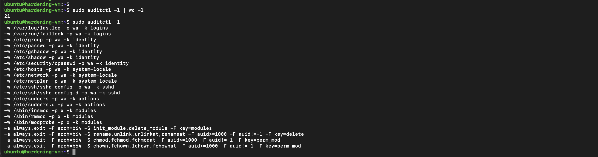

---

## 7. VPN

### 7.1 WireGuard Server Configurado

**Verificación en VPN VM:**

**Captura:** WireGuard activo y escuchando en puerto 51820

```bash
sudo wg show
sudo systemctl status wg-quick@wg0
```

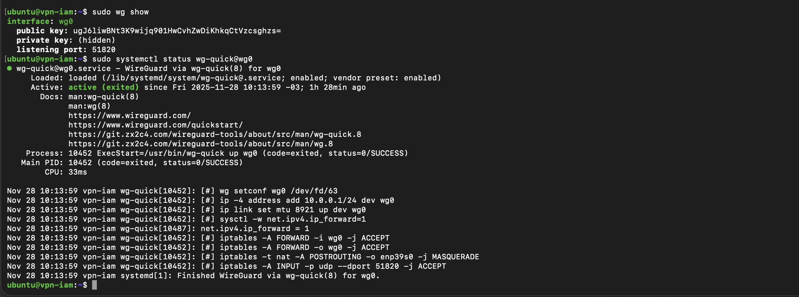

### 7.2 Generación de Configs por Rol

**Comando en VPN VM:**
```bash
cd /opt/fosil/VPN-IAM/scripts
./vpn-config-generator.sh jperez@fosil.uy
```

**Captura 1:** Script generando config con AllowedIPs basado en rol

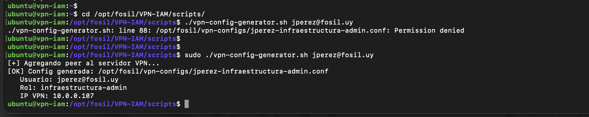

**Verificación:** Config generada en `/opt/fosil/vpn-configs/jperez-infraestructura-admin.conf`
- AllowedIPs = 10.0.1.0/24, 10.0.0.0/24 (infraestructura-admin full access)

### 7.3 WireGuard Remote Access - Cliente Conectado

**Copiar config a máquina local:**
```bash
scp -i ~/.ssh/obligatorio-srd ubuntu@<VPN_IP>:/opt/fosil/vpn-configs/jperez-infraestructura-admin.conf ~/
```

**Captura 1:** WireGuard activado en máquina local con config importada


**Captura 2:** Pings exitosos a IPs privadas (10.0.1.x)

```bash
ping -c 3 10.0.1.20  # Wazuh
ping -c 3 10.0.1.10  # WAF
ping -c 3 10.0.1.30  # VPN/IAM
ping -c 3 10.0.1.40  # Hardening
ping -c 3 10.0.1.50  # Grafana
```

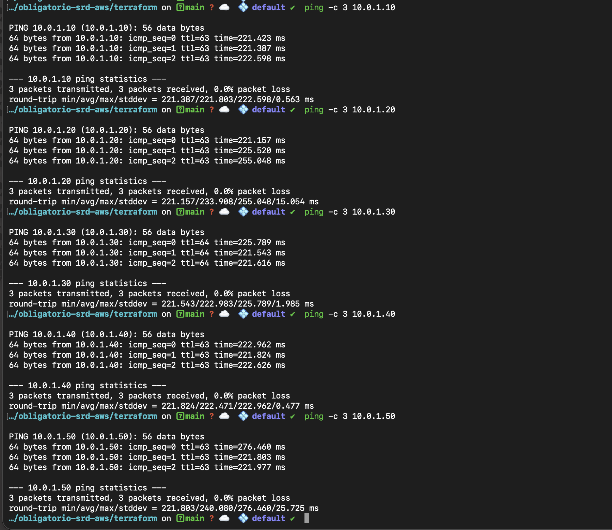

**Verificación:** Acceso remoto funcional desde máquina local a toda la VPC privada

### 7.4 IPSec Site-to-Site - Datacenter Local ↔ AWS

**Setup en Multipass VM (Datacenter local):**

**Captura 1:** Levantando VM Multipass para simular datacenter

```bash
multipass launch --name datacenter-vpn --cpus 2 --memory 2G --disk 10G
multipass shell datacenter-vpn
```


**Captura 2:** Configurando túnel IPSec en datacenter (script)

```bash
cd /opt/fosil/VPN-IAM/scripts
sudo bash setup-ipsec-datacenter.sh
```

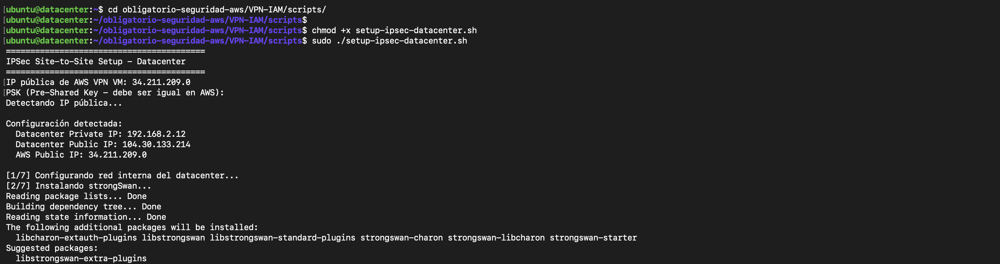

**Setup en AWS VPN VM:**

**Captura 3:** Configurando túnel IPSec en AWS

```bash
ssh ubuntu@<VPN_IP>
cd /opt/fosil/VPN-IAM/scripts
sudo bash setup-ipsec-aws.sh
```

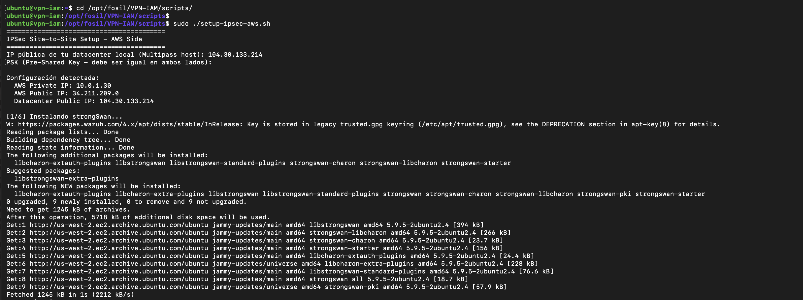

**Verificación del Túnel:**

**Captura 4:** Túnel IPSec ESTABLISHED (lado datacenter)

```bash
# En Multipass VM
sudo ipsec status
```

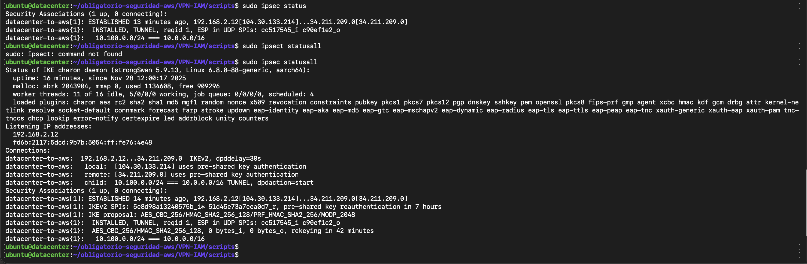

**Captura 5:** Túnel IPSec ESTABLISHED (lado AWS)

```bash
# En AWS VPN VM
sudo ipsec status
```

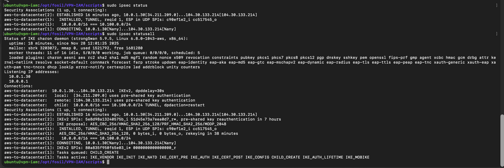

**Verificación:**
- Túnel activo entre datacenter (10.100.0.0/24) y AWS VPC (10.0.1.0/24)
- IKEv2 con AES_CBC_256/HMAC_SHA2_256_128
- Estado: ESTABLISHED

### 7.5 Multi-Factor Authentication (MFA) - TOTP

**Implementación:** MFA de doble capa en VPN Remote Access

#### Configuración Automática de OTP

**Los usuarios se crean con `requiredActions=["CONFIGURE_TOTP"]`**, forzando configuración de OTP en primer login.

**Captura 1:** Usuario jperez con Required Actions "Configure OTP" en Keycloak

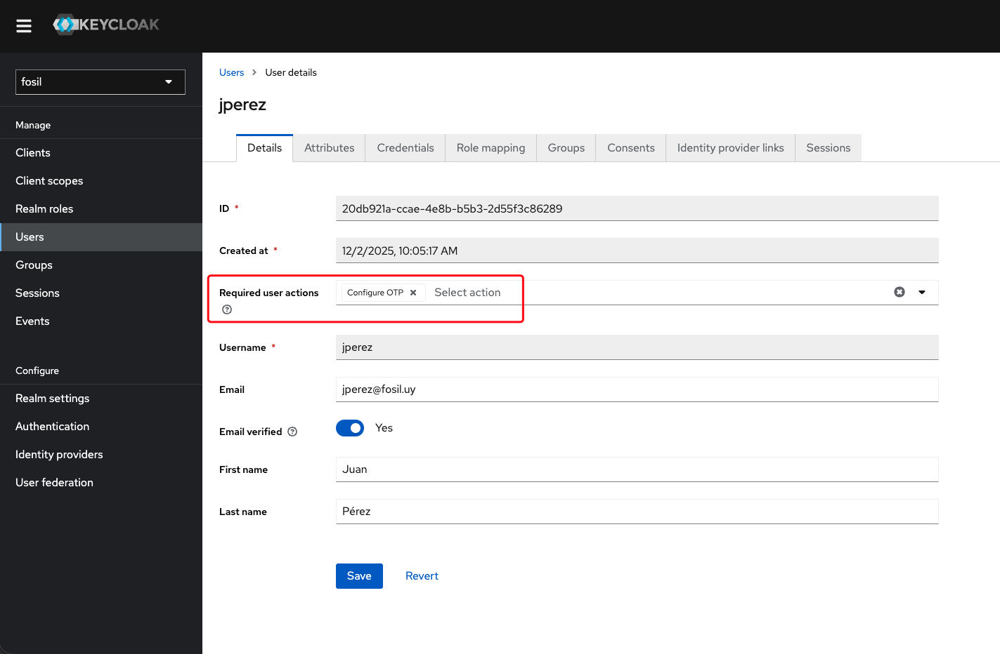

**Verificación en UI:**
- Admin Console → Realm "fosil" → Users → jperez → Required Actions
- Esperado: "Configure OTP" checked

#### Primer Login - Configuración de TOTP

**Login inicial en Grafana fuerza configuración de OTP:**

**Captura 2:** Pantalla Keycloak "Configure OTP" con QR code

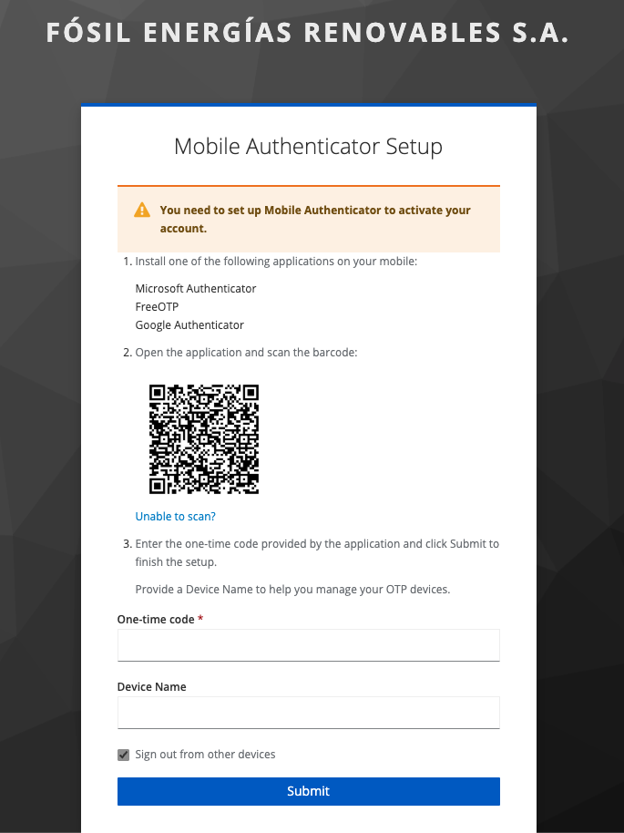

**Pasos del usuario:**
1. Escanear QR code con Google Authenticator
2. Ingresar código de 6 dígitos para verificar
3. OTP configurado exitosamente

#### MFA en Provisioning VPN

**Script `vpn-config-generator.sh` requiere autenticación MFA antes de generar config:**

**Captura 3:** Script solicitando Password de Keycloak + OTP Code

```bash
ssh ubuntu@<VPN_IP>
cd /opt/fosil/VPN-IAM/scripts
sudo bash vpn-config-generator.sh jperez@fosil.uy
```

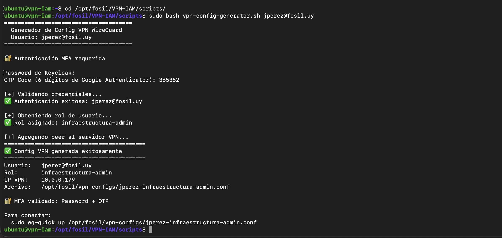

```
**Validación:**
- Password de Keycloak: `Admin123!`
- OTP Code (6 dígitos): `[código desde Google Authenticator]`
- Si OTP incorrecto o vacío → `❌ ERROR: OTP Code requerido para MFA`
```

```
**Output esperado:**
✅ Autenticación exitosa: jperez@fosil.uy
✅ Rol asignado: infraestructura-admin
✅ Config VPN generada exitosamente
🔐 MFA validado: Password + OTP
```

**Captura 4:** Autenticación MFA exitosa y generación de config VPN

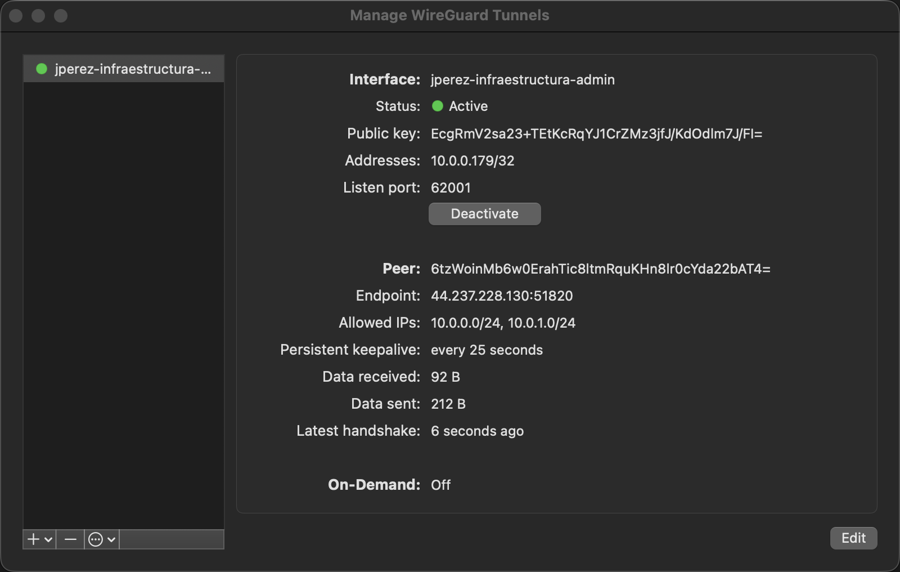

**Validación:**
- VPN conectada correctamente.

---

## 8. Resumen de Cumplimiento

### Requisitos del Obligatorio

| Requisito | Evidencia | Screenshot |
|-----------|-----------|------------|
| **1a) VPN Site-to-Site** | Túnel IPSec ESTABLISHED ambas puntas | 28a-28e |
| **1b) VPN Remote Access + IAM** | WireGuard + políticas granulares + conectividad | 25, 26, 27a-27b |
| **1c) MFA en VPN** | TOTP (Password + OTP) en provisioning VPN | 29a-29f |
| **2a) API Gateway** | Kong Dashboard servicios activos | 08 |
| **2b) WAF OWASP Top 10** | ModSecurity bloqueando ataques | 05, 09 |
| **2c) 2+ Reglas Custom WAF** | 6 reglas custom funcionando | 03 (100010-100014) |
| **2d) WAF → SIEM** | Eventos WAF en Wazuh Dashboard | 05 |
| **3a) SIEM** | Wazuh 4 agentes activos | 02, 02a |
| **3b) 3 Casos de Uso** | 3 casos implementados y testeados | 04, 05, 06 |
| **3c) Reglas Custom SIEM** | 17 reglas custom cargadas | 03 |
| **4a) IAM OAuth2** | Keycloak + Grafana OAuth funcionando | 11-18 |
| **4b) Analítica Comportamental** | Reglas 100040-100043 (IAM Analytics) | 03 |
| **4c) MFA en IAM** | TOTP forzado en usuarios (requiredActions) | 29a-29c |
| **5a) Scripts Hardening** | Script CIS aplicado | 20 |
| **5b) CIS Benchmark** | SCA 45% → 57% (+12%) | 19, 21 |
| **5c) Firewall + Audit + SSH + SIEM** | UFW + auditd + fail2ban + Wazuh | 22-24 |

**Estado:** ✅ Todos los requisitos cumplidos y verificados (incluido MFA TOTP)

---
